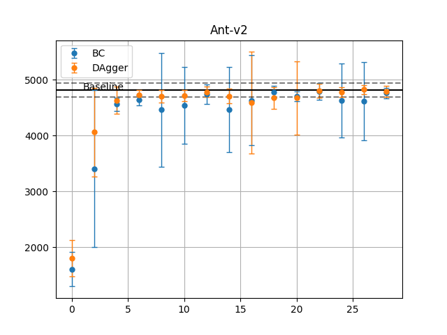
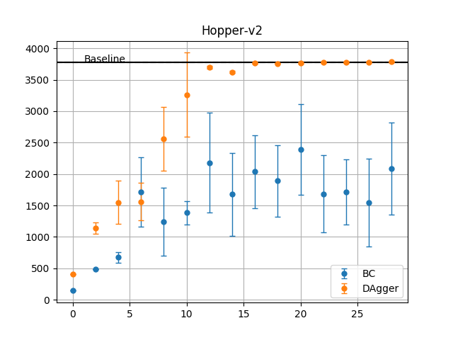

# CS294-112 HW 1: Imitation Learning

In this assignment, Behavioral Cloning and DAgger algorithms were implemented. Please see 'imitation_agent.py' for details.

In some cases, DAgger have better performance compared with Behavioral Cloning; while in other cases not.

To get the above plots, please run the follow commands.
"""
python run_expert.py experts/Ant-v2.pkl Ant-v2 --num_rollouts 20
python imitation_agent.py 'Ant-v2' --num_epochs 30
python run_expert.py experts/Hopper-v2.pkl Hopper-v2 --num_rollouts 20
python imitation_agent.py 'Hopper-v2' --num_epochs 30
"""

----
Dependencies:
 * Python **3.5**
 * Numpy version **1.14.5**
 * TensorFlow version **1.10.5**
 * MuJoCo version **1.50** and mujoco-py **1.50.1.56**
 * OpenAI Gym version **0.10.5**

Once Python **3.5** is installed, you can install the remaining dependencies using `pip install -r requirements.txt`.

**Note**: MuJoCo versions until 1.5 do not support NVMe disks therefore won't be compatible with recent Mac machines.
There is a request for OpenAI to support it that can be followed [here](https://github.com/openai/gym/issues/638).

**Note**: Students enrolled in the course will receive an email with their MuJoCo activation key. Please do **not** share this key.

The only file that you need to look at is `run_expert.py`, which is code to load up an expert policy, run a specified number of roll-outs, and save out data.

In `experts/`, the provided expert policies are:
* Ant-v2.pkl
* HalfCheetah-v2.pkl
* Hopper-v2.pkl
* Humanoid-v2.pkl
* Reacher-v2.pkl
* Walker2d-v2.pkl

The name of the pickle file corresponds to the name of the gym environment.
