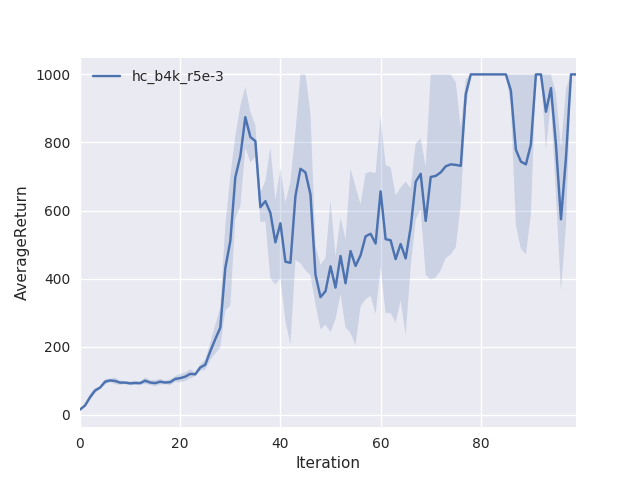

# CS294-112 HW 2: Policy Gradient

In this assignment, Policy Gradient is implemented, with reward-to-go and state-dependent baseline for reducing variance.

## P4: CartPole
This experiment explored how batch-size, variance-reduction methods (advantage-centering and reward-to-go), learning rate, and NN architecture would influence the performance of policy gradient.

<div align="center">

</div>
<div align="center">

</div>

```
python train_pg_f18.py CartPole-v0 -n 100 -b 1000 -e 3 -dna --exp_name sb_no_rtg_dna
python train_pg_f18.py CartPole-v0 -n 100 -b 1000 -e 3 -rtg -dna --exp_name sb_rtg_dna
python train_pg_f18.py CartPole-v0 -n 100 -b 1000 -e 3 -rtg --exp_name sb_rtg_na

python train_pg_f18.py CartPole-v0 -n 100 -b 5000 -e 3 -dna --exp_name lb_no_rtg_dna
python train_pg_f18.py CartPole-v0 -n 100 -b 5000 -e 3 -rtg -dna --exp_name lb_rtg_dna
python train_pg_f18.py CartPole-v0 -n 100 -b 5000 -e 3 -rtg --exp_name lb_rtg_na

python train_pg_f18.py CartPole-v0 -n 100 -b 1000 -e 3 -lr 5e-4 -rtg --exp_name sb_rtg_na_lr5e10-4
python train_pg_f18.py CartPole-v0 -n 100 -b 1000 -e 3 -lr 5e-3 -rtg --exp_name sb_rtg_na_lr5e10-3
python train_pg_f18.py CartPole-v0 -n 100 -b 1000 -e 3 -lr 5e-2 -rtg --exp_name sb_rtg_na_lr5e10-2

python train_pg_f18.py CartPole-v0 -n 100 -b 1000 -e 3 -l 1 -rtg --exp_name sb_rtg_na_l1
python train_pg_f18.py CartPole-v0 -n 100 -b 1000 -e 3 -l 2 -rtg --exp_name sb_rtg_na_l2
python train_pg_f18.py CartPole-v0 -n 100 -b 1000 -e 3 -l 3 -rtg --exp_name sb_rtg_na_l3
```

## P5: InvertedPendulum
This experiment explored hyperparameter choices and PG in continous action space.

<div align="center">

</div>

```
python train_pg_f18.py InvertedPendulum-v2 -ep 1000 --discount 0.9 -n 100 -e 3 -l 2 -s 64 -b 10000 -lr 5e-2 -rtg --exp_name hc_b10k_r1e-2
```

## P7: LunarLander
This experiment tested PG performance in the Lunar Lander environment.

<div align="center">

</div>

## P8: HalfCheetah
This experiment first chose hyperparameters for batch-size and learning rate using grid search, then tested the performance of difference variance-reduction methods. The results show that with sufficient batch-size, NN baseline may not be able to improve performance.

<div align="center">

</div>

----
Dependencies:
 * Python **3.5**
 * Numpy version **1.14.5**
 * TensorFlow version **1.10.5**
 * MuJoCo version **1.50** and mujoco-py **1.50.1.56**
 * OpenAI Gym version **0.10.5**
 * seaborn
 * Box2D==**2.3.2**

Before doing anything, first replace `gym/envs/box2d/lunar_lander.py` with the provided `lunar_lander.py` file.

The only file that you need to look at is `train_pg_f18.py`, which you will implement.

See the [HW2 PDF](http://rail.eecs.berkeley.edu/deeprlcourse/static/homeworks/hw2.pdf) for further instructions.
